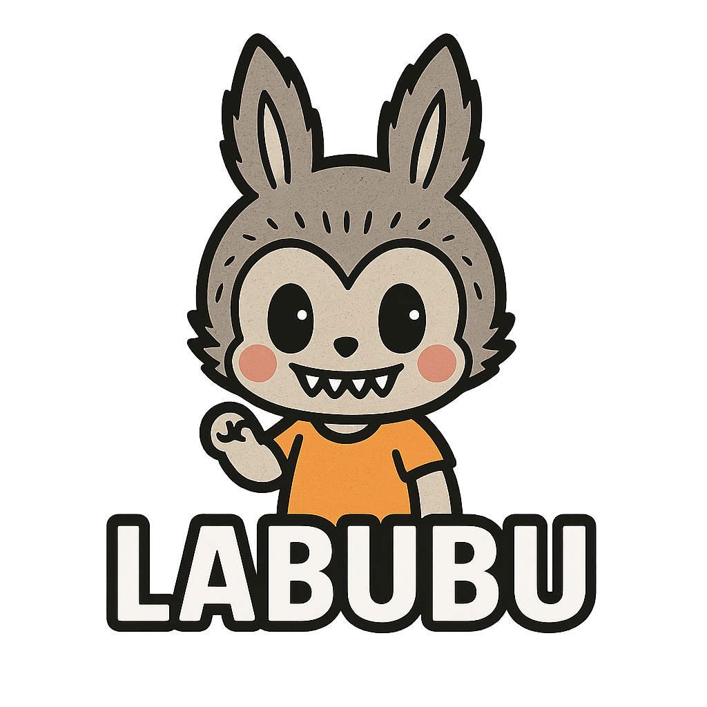

# LABUBU Token

**LABUBU** is a Solana-based meme token born to capture the hearts of billions across Asia, India, and the world.  
Built with speed, community, and creativity in mind, LABUBU aims to become the next cultural icon in crypto.

## 🌟 Key Features

- 🐇 100% community-driven
- 💛 Launched on the Solana blockchain
- 🚀 Designed for virality and meme culture
- 🌍 Focus on Asia & India as key regions

## 📊 Tokenomics

- Total Supply: **1,000,000,000 LABU**
- No taxes, no pre-sale, no team allocation
- Transparent, fair launch

## 📅 Roadmap

1. Launch & Phantom integration  
2. CoinGecko & CoinMarketCap submissions  
3. Twitter + Telegram community  
4. Airdrop campaigns  
5. DEX listing (Raydium, Orca)  
6. Strategic partnerships  
7. NFT integration & staking

## 🖼️ Logo

## 🔗 Useful Links

- Website: *coming soon*
- Twitter: *coming soon*
- Solana Token Address: `2ygXYFRC82ZjoEEWt5rfEHPVfEdKxWb747GjQSHgVzxi`
